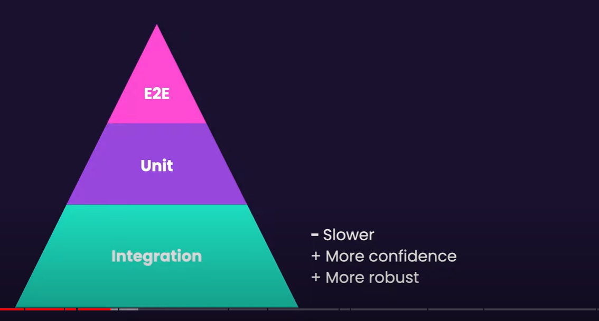

### React Testing

### 🟢 Prerequisites

#### 🟢 What You Should Know

- React
- TypeScript
- Unit Testing Fundamentals

#### 🟢 Course Structure

- Testing Component
- Mocking APIs
- Testing Forms
- Testing State Management
- Testing Authentication
- Testing Routing

#### 🟢 How to Take this Course

#### Curriculum

- Testing Components
- Mocking APIs
- Testing Forms
- Testing State Management
- Testing Authentication
- Testing Routing

#### 🟢 Setting Up Vitest

#### Testing Framework

- Jest -- Experimental support for ECMAScript Modules
- Mocha
- Jasmine
- Vitest -- Support ESM, TypeScript, and JSX

#### 🟢 Setting Up React Testing Library

#### Dom Emulation

- JSDOM
- HappyDOM

#### 🟢 Testing React Component

#### You'll Learn

- What to test
- Testing rendering
- Testing user interactions
- Working with component libs
- Techniques to simplify tests
- Catching issues with ESLint

#### 🟢 What to Test

#### Testing Component

- How they render
- How they respond to user actions

=> Write tests that are maintainable, robust and trustworthy.
=> No test > Bad Tests
=> Test the behavior, not the implementation




#### 🟢 Don't test styles!

#### Visual Tests

- Can be fragile.
- Don't deliver value.

=> Test the behavior not the styles

#### 🟢 Testing Rendering

src/components/Greet.tsx

```typeScript
import React from "react";

const Greet = ({ name }: { name?: string }) => {
  if (name) return <h1>Hello {name}</h1>;

  return <button>Login</button>;
};

export default Greet;

```

src/components/Greet.test.tsx

```typeScript
import React from "react";
import { describe, expect, it } from "vitest";
import { render, screen } from "@testing-library/react";
import Greet from "../../components/Greet";
import "@testing-library/jest-dom/vitest";

describe("Greet", () => {
  it("Should render Hello with the name when name is provided", () => {
    render(<Greet name="John" />);

    const heading = screen.getByRole("heading");
    expect(heading).toBeInTheDocument();
    expect(heading).toHaveTextContent(/john/i);
  });
});

describe("Greet", () => {
  it("Should render login button when name is not provided", () => {
    render(<Greet />);

    const button = screen.getByRole("button");
    expect(button).toBeInTheDocument();
    expect(button).toHaveTextContent(/login/i);
  });
});

```

#### 🟢 Simplifying Test Setup

src/tests/setup.ts

```typeScript
import "@testing-library/jest-dom/vitest";
```

#### Fix error remove import React from "react"; config in tsconfig.json

```typescript
"jsx": "react-jsx",
```

#### 🟢 Exercise: Testing UserAccount

src/components/UserAccount.tsx

```ts
import { User } from "../../entities";

interface IUserAccountProps {
  user: User;
}
const UserAccount = ({ user }: IUserAccountProps) => {
  return (
    <>
      <h2>User Profile</h2>
      {user.isAdmin && <button>Edit</button>}
      <div>
        <strong>Name:</strong> {user.name}
      </div>
    </>
  );
};

export default UserAccount;
```

src/tests/components/UserAccount.test.tsx

```ts
import { describe, expect, it } from "vitest";
import { User } from "../../../entities";
import { render, screen } from "@testing-library/react";
import UserAccount from "../../components/userAccount";

describe("UserAccount", () => {
  it("Should render user name", () => {
    const user: User = { id: 1, name: "John Doe" };
    render(<UserAccount user={user} />);

    expect(screen.getByText(user.name)).toBeInTheDocument();
  });
});

describe("UserAccount", () => {
  it("Should render edit button if user is admin", () => {
    const user: User = { id: 1, name: "John Doe", isAdmin: true };
    render(<UserAccount user={user} />);

    const button = screen.getByRole("button");
    expect(button).toBeInTheDocument();
    expect(button).toHaveTextContent(/edit/i);
  });
});

describe("UserAccount", () => {
  it("Should not render edit button if user is not admin", () => {
    const user: User = { id: 1, name: "John Doe" };
    render(<UserAccount user={user} />);

    const button = screen.queryByRole("button");
    expect(button).not.toBeInTheDocument();
  });
});
```

#### 🟢 Testing List

src/components/UserList.tsx

```ts
import { User } from "../../entities";

const UserList = ({ users }: { users: User[] }) => {
  if (users.length === 0) return <p>No users available.</p>;

  return (
    <ul>
      {users.map((user) => (
        <li key={user.id}>
          <a href={`/users/${user.id}`}>{user.name}</a>
        </li>
      ))}
    </ul>
  );
};

export default UserList;
```

src/components/UserList.test.tsx

```ts
import { render, screen } from "@testing-library/react";
import { describe, expect, it } from "vitest";
import UserList from "../../components/UserList";
import { User } from "../../../entities";

describe("UserList", () => {
  it("Should render no users when the users array is empty", () => {
    render(<UserList users={[]} />);

    const noUsersElement = screen.getByText("No users available.");
    expect(noUsersElement).toBeInTheDocument();
  });
});

describe("UserList", () => {
  it("Should render a list of users", () => {
    const users: User[] = [
      {
        id: 1,
        name: "John Doe",
      },
      {
        id: 2,
        name: "Jane Smith",
      },
    ];
    render(<UserList users={users} />);

    const userElement = screen.getByText("John Doe");
    expect(userElement).toBeInTheDocument();

    users.forEach((user) => {
      const userLink = screen.getByText(user.name);
      expect(userLink).toHaveAttribute("href", `/users/${user.id}`);
    });
  });
});
```

Exercise: 🟢 Testing ProductImageGallery

src/components/ProductGallery.tsx

```tsx
const ProductImageGallery = ({ imageUrls }: { imageUrls: string[] }) => {
  if (imageUrls.length === 0) return null;

  return (
    <ul>
      {imageUrls.map((url) => (
        <li key={url}>
          
        </li>
      ))}
    </ul>
  );
};

export default ProductImageGallery;
```

src/tests/components/ProductImageGallery.test.tsx

```tsx
import { render, screen } from "@testing-library/react";
import { describe, expect, it } from "vitest";
import ProductImageGallery from "../../components/ProductImageGallery";

describe("ProductImageGallery", () => {
  it("Should render nothing if given an empty array of images", () => {
    const { container } = render(<ProductImageGallery imageUrls={[]} />);

    expect(container).toBeEmptyDOMElement();
  });

  it("Should render a list of images", () => {
    const imageUrls = [
      "https://example.com/image1.jpg",
      "https://example.com/image2",
    ];
    render(<ProductImageGallery imageUrls={imageUrls} />);

    const images = screen.getAllByRole("img");
    expect(images).toHaveLength(2);
    imageUrls.forEach((url, index) => {
      expect(images[index]).toHaveAttribute("src", url);
    });
  });
});
```

#### 🟢 Reference

https://testing-library.com/docs/ <br>
https://github.com/mosh-hamedani/react-testing-starter <br>
https://github.com/testing-library/jest-dom

#### 🟢 Next Action

### 🟢 You'll Learn

- Mocking APIs
- Testing Forms
- Testing State management
- Testing authentication
- Testing routing
